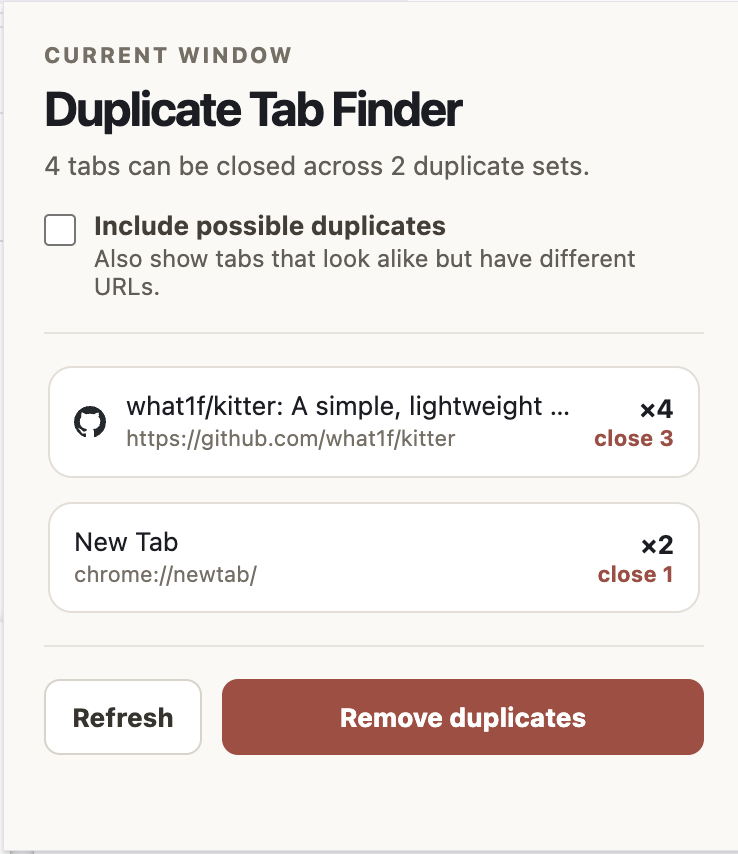

<div align="center">


# Duplicate Tab Finder

**Find duplicate tabs in your current Chrome window and close the extras in one click.**


</div>

<div align="center">



</div>

---

## Purpose

A busy browsing session collects the same page over and over. Duplicate Tab Finder shows you which tabs in the current window point at the same page, then closes the extras. The first tab in each set always stays open.

## What counts as a duplicate?

**Duplicate tab**: two or more tabs open on the same page. URLs are compared after ignoring differences that don't change the page:

- the `#fragment`
- common tracking parameters (`utm_*`, `gclid`, `fbclid`, `msclkid`, `ref`, and similar)
- `http` vs `https`, a leading `www.`, a trailing slash, and a trailing `/index.html`
- the order of query parameters

So `http://www.example.com/a/` and `https://example.com/a?utm_source=x#top` are duplicates.

**Possible duplicate tab**: tabs that look alike but have different URLs, so they might or might not be the same page. Two rules find them:

- **Same title**: the titles match (ignoring case and extra spaces) but the URLs differ.
- **Same page, different query**: same site and path, but a different query string, such as `/post?id=1` and `/post?id=2`.

Possible duplicates are guesses, so they are for review only. The extension never closes them automatically.

## Features

- **Duplicate detection** for the current window, grouped into sets of matching tabs. Each set is one row showing the page title, its URL, the number of tabs (`×3`) and how many would be closed.
- **Smart matching** as described above.
- **One-click cleanup** with a confirmation prompt. The first (leftmost) tab in each set stays open.
- **Include possible duplicates** (optional setting) also lists possible duplicate tabs, grouped by the reason they matched. The part of each URL that differs is highlighted. Click a tab to switch to it, or use **×** to close just that one.
- **Private by design**: no data collected, nothing sent anywhere. The only stored value is your "Include possible duplicates" preference.

## Usage

1. Click the **Duplicate Tab Finder** toolbar icon.
2. Review the duplicate sets. Each row shows how many tabs will be closed.
3. Click **Remove duplicates** and confirm. The first tab in each set stays open.
4. Click **Refresh** to rescan after changing your tabs.

To review tabs that might be duplicates, tick **Include possible duplicates**. The setting is remembered. **Remove duplicates** never touches these; close them individually with **×**.

## Installation

Load it as an unpacked extension:

1. Clone the repository.
   ```bash
   git clone https://github.com/<your-username>/chrome-find-duplicate-tabs.git
   ```
2. Open `chrome://extensions` in Chrome.
3. Turn on **Developer mode**.
4. Click **Load unpacked** and select the project folder.

## Permissions

| Permission | Why it's needed |
| --- | --- |
| `tabs` | Read tab URLs and titles in the current window, and close duplicates. |
| `storage` | Remember the "Include possible duplicates" setting. |

## Project structure

```text
manifest.json              Extension manifest (Manifest V3)
popup.html                 Popup markup
popup.css                  Popup styles
popup.js                   Duplicate matching, rendering, and tab removal
assets/icon.svg            Vector master for the toolbar and store icon
assets/icons/              Generated PNG icons (16, 32, 48, 128 px)
tools/generate_icons.py    Rebuilds the icon files above
```

## Icon

The mark is the same tab twice: a muted duplicate behind, the tab that stays open in front, and the extra one badged in the same red the popup uses for **Remove duplicates**.

Every icon file is generated from the geometry in `tools/generate_icons.py`, which also writes the `assets/icon.svg` master, so the vector and the PNGs can never fall out of sync:

```bash
python3 -m pip install pillow
python3 tools/generate_icons.py
```

Edit the colors and shapes at the top of that file to change the icon, then commit the regenerated files.

## Authors

- **Russell Dickenson**
- **Claude** (Anthropic)

## License

Licensed under the [GNU General Public License v3.0](https://www.gnu.org/licenses/gpl-3.0.txt).
